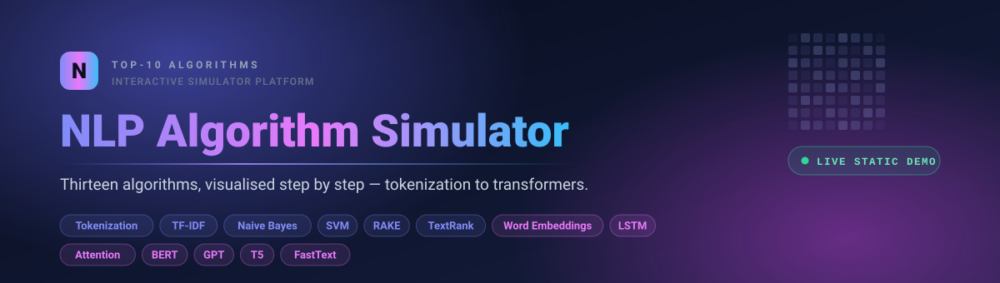

<p align="center">
  
</p>

<p align="center">
  <a href="https://hammadshakeelai.github.io/TOP-10-NLP-ALGORITHMS-SIMULATORS/"></a>
  <a href="../../actions/workflows/deploy-pages.yml"></a>
  
  
  
  <a href="LICENSE"></a>
</p>

<h3 align="center">
  <a href="https://hammadshakeelai.github.io/TOP-10-NLP-ALGORITHMS-SIMULATORS/">→ Open the live simulator</a>
</h3>

---

An interactive platform for **learning how NLP algorithms actually work**. Pick an
algorithm, feed it text, tune its parameters, then step through every intermediate
stage — token offsets, IDF weights, attention heads, LSTM gates, PageRank
iterations — with formulas, explanations and charts attached to each step.

Every simulator explains itself at five levels: **Beginner, Student, Researcher,
Engineer, Instructor**. The same run reads as a plain-language walkthrough or as a
formal treatment with references, depending on which you pick.

## The live demo runs without a backend

The hosted site is a **static build**. It ships a pre-computed reference run for
each of the 13 algorithms and makes **no network requests at all** — no API, no
Python, no model downloads.

> [!IMPORTANT]
> In the static demo, entering your own text **replays the pre-computed reference
> run** rather than simulating what you typed. Every result carries a
> `STATIC_MODE` warning saying so. To simulate your own inputs, run the platform
> locally with the backend — see [Quick start](#quick-start).

Full details in [`docs/STATIC_DEPLOY.md`](docs/STATIC_DEPLOY.md).

## Algorithms

### Classical

| Algorithm | What you can watch happen |
|---|---|
| **Tokenization** | Whitespace, regex, toy BPE and toy WordPiece side by side, with character offsets and per-token traces |
| **TF-IDF** | TF, IDF and TF-IDF computed from scratch, then cosine similarity and query ranking |
| **Naive Bayes** | Class priors, per-feature likelihoods, posterior probabilities, confusion matrix |
| **SVM** | LinearSVC with calibrated probabilities, margin distances and top contributing features |
| **RAKE** | Candidate phrase extraction, word degree/frequency scoring, co-occurrence graph |
| **TextRank** | Keyword and summary modes, with the PageRank convergence trace exposed |

### Neural and transformer

| Algorithm | What you can watch happen |
|---|---|
| **Word embeddings** | Toy SVD embeddings or pretrained vectors, PCA projection, analogy arithmetic |
| **LSTM** | A toy recurrent cell with forget/input/output gate values at every timestep |
| **Transformer attention** | Multi-head attention from scratch — Q/K/V, positional encodings, causal masking |
| **BERT** | HuggingFace pipelines for masked LM, sentiment, NER and extractive QA |
| **GPT** | Autoregressive generation with temperature, top-k and top-p decoding |
| **T5** | Text-to-text transfer with beam candidates |
| **FastText** | Subword n-gram breakdown and supervised classification |

## Quick start

Full Windows instructions live in [`docs/RUNBOOK.md`](docs/RUNBOOK.md).

### Backend

```powershell
pip install -r services/classical-nlp-service/requirements.txt
uvicorn main:app --app-dir apps/api-gateway --reload --port 8000
```

- Health: `http://127.0.0.1:8000/health`
- Catalog: `http://127.0.0.1:8000/algorithms/`
- OpenAPI docs: `http://127.0.0.1:8000/docs`

`http://127.0.0.1:8000/` returns `404` by design — the API defines no homepage route.

The transformer simulators need heavier dependencies (`torch`, `transformers`,
`gensim`, `fasttext`). Each degrades gracefully with an explanatory warning when
its library is missing, so the platform still runs without them.

### Frontend

```powershell
cd apps/web-ui
npm install
npm run dev
```

Open `http://localhost:5173`.

### Docker Compose

```powershell
docker compose -f infra/docker-compose.yml up --build
```

Brings up the gateway (`:8000`), classical (`:8001`) and transformer (`:8002`)
service placeholders, PostgreSQL (`:5432`) and Redis (`:6379`).

## Building the static site

```powershell
cd apps/web-ui
$env:VITE_STATIC_MODE = "true"
$env:VITE_BASE_PATH = "/TOP-10-NLP-ALGORITHMS-SIMULATORS/"
npm run build
```

| Variable | Default | Purpose |
|---|---|---|
| `VITE_STATIC_MODE` | unset | `"true"` builds the backend-free bundle |
| `VITE_BASE_PATH` | `/` | Sub-path for project-site hosting |
| `VITE_API_URL` | `http://localhost:8000` | Gateway URL; ignored in static mode |

Leaving all three unset produces the normal backend-connected build. See
[`apps/web-ui/.env.example`](apps/web-ui/.env.example).

Pushing to `main` triggers [`deploy-pages.yml`](.github/workflows/deploy-pages.yml),
which builds this bundle and publishes it to GitHub Pages.

## Testing

```powershell
pip install -r services/classical-nlp-service/requirements.txt pytest
python -m pytest tests -q
```

```powershell
cd apps/web-ui
npm run build
```

The suite covers unit tests per simulator, golden-output tests and API
integration tests.

> [!NOTE]
> Two simulators — `lstm` and `transformer_attention` — seed their toy weights
> partly from Python's `hash()` of each token. Python randomises string hashing
> per process unless `PYTHONHASHSEED` is pinned, so their outputs are **not
> reproducible across restarts**. Treat their goldens accordingly.

## Repository layout

```text
.github/workflows/      Pages build and deploy
apps/
  api-gateway/          FastAPI gateway — health, algorithms, runs, exports
  web-ui/               React + TypeScript + Vite UI
    src/mocks/          pre-computed snapshots powering the static demo
datasets/examples/      sample datasets
docs/                   runbook, implementation status, static deploy guide
infra/                  Docker Compose and Dockerfiles
packages/
  shared-schemas/       canonical Pydantic schema source
  shared_schemas/       importable Python package alias
services/
  classical-nlp-service/
  transformer-service/
  export-service/
tests/                  unit, golden, integration
```

## API overview

```http
GET  /health
GET  /algorithms/
GET  /algorithms/{algorithm_id}
GET  /algorithms/{algorithm_id}/demo
POST /runs/
GET  /runs/{run_id}
POST /exports/{run_id}
```

Example run request:

```json
{
  "algorithm_id": "tfidf",
  "mode": "learning",
  "documents": [
    {"id": "d1", "text": "NLP transforms text into features."},
    {"id": "d2", "text": "TF-IDF ranks important terms in documents."}
  ],
  "parameters": { "top_n": 10, "smooth_idf": true },
  "trace_level": "full"
}
```

## Implementation notes

- Every simulator returns a shared Pydantic `RunResponse`.
- Visualizations travel as `visualization_specs`; the frontend dispatches
  `bar`, `heatmap`, `scatter`, `line`, `table`, `diff` and `graph`.
- `@xyflow/react` renders the RAKE and TextRank co-occurrence graphs.
- Exports produce JSON and CSV from in-memory run data — persistent storage is
  not wired up yet.

See [`docs/IMPLEMENTATION_STATUS.md`](docs/IMPLEMENTATION_STATUS.md) for the full
implementation log and follow-up work.

## Troubleshooting

**"Failed to load catalog"** — check `http://127.0.0.1:8000/health` and
`http://127.0.0.1:8000/algorithms/`. If `/health` responds but `/algorithms/`
does not, restart the gateway.

**The UI shows an "Offline demo" badge** — the frontend could not reach the
backend and fell back to bundled snapshots. Start the gateway and reload. A badge
reading "Static demo" instead is expected: that build was compiled backend-free
on purpose.

**`npm ci` fails with `Missing: yaml@2.9.0 from lock file`** — you are on Node 20
(npm 10). Use Node 24; `yaml@2` is an optional peer of `postcss-load-config` that
the two npm versions disagree about.

## License

[MIT](LICENSE) © hammadai
